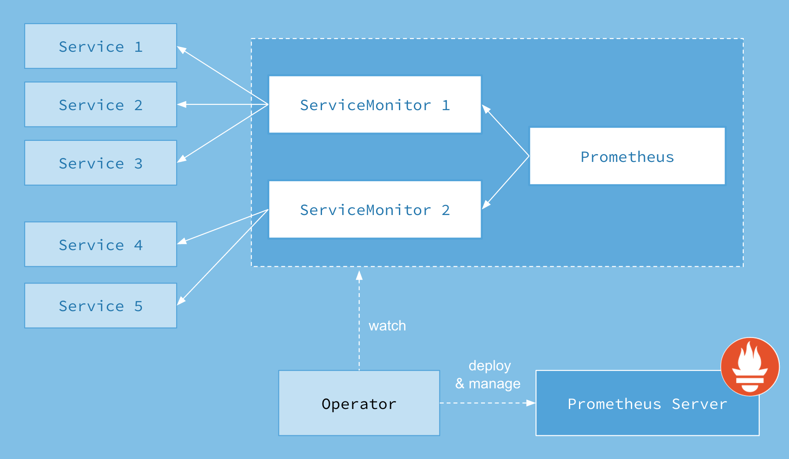
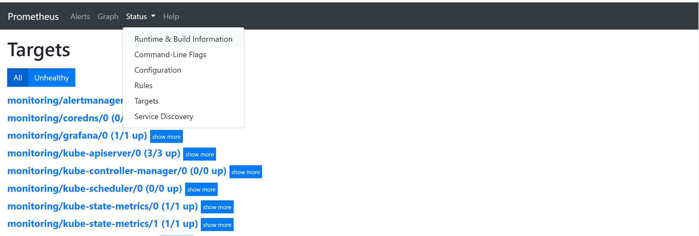
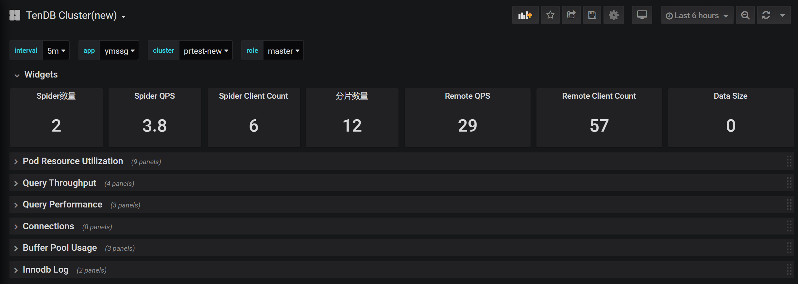

DB on Kubernetes的监控基于社区kube-prometheus(https://github.com/coreos/kube-prometheus) 部署实现，性能数据采集基于定制的DB exporter，使用Grafana进行数据可视化展示。

# Kube-Prometheus介绍
Kube-Prometheus实际由以下几部分组成：
* The Prometheus Operator
* Highly available Prometheus
* Highly available Alertmanager
* Prometheus node-exporter
* Prometheus Adapter for Kubernetes Metrics APIs
* kube-state-metrics
* Grafana

其中Prometheus Operator为核心组件，如下为Prometheus operator的结构图，作为一个控制器，他会去创建Prometheus、ServiceMonitor、AlertManager以及PrometheusRule4个CRD资源对象，然后会一直监控并维持这4个资源对象的状态



ServiceMonitor和PodMonitor则搜集相应资源对象的数据，在DB on Kubernetes方案中，db和对应的db exporter部署在一个pod中，Pod Monitor搜集exporter采集的数据上报到Prometheus存储，Grafana进行数据可视化展示。

# 性能数据采集
部署完kube-Prometheus之后，性能数据存储在Prometheus中，可以通过如下命令查看kube-Prometheus的资源信息：
```
$ kubectl get all -n monitoring
$ kubectl get node -o wide -n monitoring
```
在结果中可以得到prometheus的NodeIP，以及service/prometheus的端口信息，默认使用30900。查看Prometheus采集的所有指标，可以执行如下命令：
```
$ curl ${NodeIP}:30900/metrics
```
通过浏览器查看Prometheus的配置



# Grafana性能数据可视化
查看kube-Prometheus资源中，service/grafana的端口信息，通过prometheus的NodeIP和grafana端口访问grafana，默认端口30902。
导入对应DB的grafana模板之后，即可查看DB的性能数据。

如下为TenDBCluster的性能数据，包括TenDBCluster pod资源使用的情况，请求吞吐情况，请求性能表现，连接情况，Buffer Pool的使用情况以及Innodb log。


