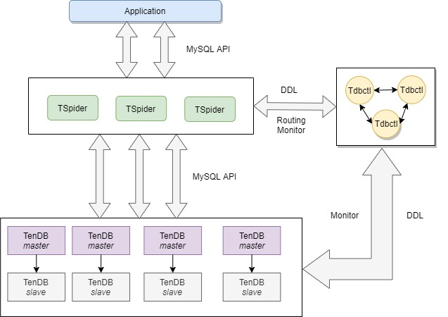
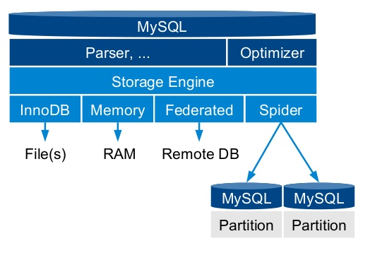

# TenDB cluster Overall Architecture  
TenDB Cluster mainly includes three core components: TSpider, TenDB and Tdbctl.
There is also TenDB Cluster Operator that simplifies deployment management on the cloud.

## TSpider
TSpider is the proxy node of TenDB Cluster.   

TSpider was developed by the Tencent Game DBA team based on MariaDB's open source storage engine spider. It is the largest distributed MySQL storage engine in the game scene. TSpider uses the characteristics of the MySQL partition table, but stores the data of each partition in a remote MySQL instance.   

As a MySQL storage engine, TSpider naturally supports the MySQL protocol, and applications can request TSpider using the MySQL standard API.   

After receiving  the application request, TSpider will rewrite the SQL through data sharding rules and distribute it to the corresponding TenDB data node for execution, and then process the returned result of data node and finally return it to the application.

TSpider itself does not store data and it is basically stateless (the configuration of each TSpider node needs to be different), and can be expanded horizontally unlimitedly. The application can access multiple TSpider nodes through the unified access address provided by load balancing components (such as LVS, L5, and even DNS).

## TenDB
TenDB is the data node of TenDB Cluster.   

TenDB is customized by the Tencent Game DBA team based on open source MySQL. It provides additional features such as instant add column, big column compression, binlog compression, binlog speed limit, performance optimization, distributed transaction optimization, BUG FIX, etc. It is currently the default MySQL storage version of Tencent Games.

Usually a TenDB Cluster has multiple TenDB instances, and each TenDB instance stores cluster data on average. In the deployment, each TenDB instance uses the Master/Slave or MGR deployment to ensure the high availability of TenDB instances.

## Tdbctl
Tdbctl is the control node of TenDB Cluster.

The main functions of Tdbctl are cluster sharding rules management, cluster DDL operating, cluster switchover and cluster monitoring.

Cluster sharding rules management refers to maintaining the sharding rules directions from TSpider to TenDB and ensuring the availability and uniqueness of the sharding rules configuration.

The cluster DDL operating means that TSpider receives the DDL request and will be forwarded to Tdbctl. After Tdbctl rewrites the SQL, it will be distributed to TSpider/TenDB nodes for execution.

Cluster monitoring means that Tdbctl will monitor the permissions, sharding rules, table structure and availability of the TenDB Cluster.

Tdbctl is a MySQL-based tool that supports MySQL's MGR feature.
Therefore, in the deployment, we use 3 or more Tdbctl nodes to build an MGR cluster, so as to ensure the high availability of the central control node and the strong consistency of the routing configuration.

## TenDB Cluster Operator
TenDB Cluster Operator provides the ability to deploy and manage TenDB Cluster on main cloud infrastructure (Kubernetes). It utilizes Kubernetes' container orchestration capabilities and TenDB Cluster's cluster management capabilities to integrate one-click deployment, one-key scaling, failover, and fault self-healing capabilities, which greatly reduces the cost of user management and use of TenDB Cluster.

