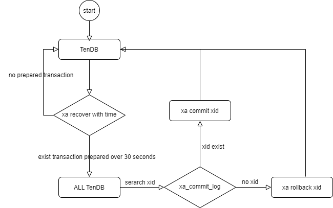

# 与单实例MySQL异同
TenDB Cluster集群主要是由多个接入层TSpider实例及存储TSpider通过分片规则打散后数据的TenDB存储实例构成。
虽然TSpider利用了spider这一MySQL引擎，能够兼容绝多MySQL标准用法，但还是有些地方和单实例MySQL有一些差异。下面进行展开描述。

## 不支持特性
- 多唯一键
- 外键约束
- 修改shard key（分区键）
- XA语法
- CREATE TABLE tb AS SELECT语法
- CREATE TEMPORARY TABLE语法
- Savepoints
## 与MySQL有差异的特性
### **DDL**
分别从CREATE TABLE和ALTER TABLE来说明和单实例MySQL的部分差异
#### CREATE TABLE
用户建一个InnoDB表，建表SQL如下：
```
CREATE TABLE `t1` (
  `c1` int(11) NOT NULL,
  `c2` int(11) DEFAULT NULL,
  PRIMARY KEY (`c1`)
) ENGINE=InnoDB DEFAULT CHARSET=utf8mb4
```
上述建表SQL会转发到中控节点Tdbctl，再由Tdbctl分发各个接入层TSpider节点和各个存储节点TenDB。在用户得到建表成功的反馈后， 执行show create table展示如下：
```
mysql> show create table t1\G
********************* 1. row**********************
       Table: t1
Create Table: CREATE TABLE `t1` (
  `c1` int(11) NOT NULL,
  `c2` int(11) DEFAULT NULL,
  PRIMARY KEY (`c1`)
) ENGINE=SPIDER DEFAULT CHARSET=utf8mb4
 PARTITION BY LIST (crc32(`c1`) MOD 4)
(PARTITION `pt0` VALUES IN (0) COMMENT = 'database "tendb_test_0", table "t1", server "SPT0"' ENGINE = SPIDER,
 PARTITION `pt1` VALUES IN (1) COMMENT = 'database "tendb_test_1", table "t1", server "SPT1"' ENGINE = SPIDER,
 PARTITION `pt2` VALUES IN (2) COMMENT = 'database "tendb_test_2", table "t1", server "SPT2"' ENGINE = SPIDER,
 PARTITION `pt3` VALUES IN (3) COMMENT = 'database "tendb_test_3", table "t1", server "SPT3"' ENGINE = SPIDER)
1 row in set (0.00 sec)
```
show create table得到的结果和使用单实例MySQL不一样，展现给用户的一个对PRIMARY KEY字段进行分区的分区表，且存储引擎是spider。但用户可以完全像访问InnoDB表一样对TSpider上的表t1进行增删改查。
此时，各存储实例TenDB分别有库tendb_test_0、tendb_test_1、tendb_test_2、tendb_test_3，每个库下都有一个t1表。
```
mysql> show create table tendb_test_0.t1\G
********************* 1. row *********************
       Table: t1
Create Table: CREATE TABLE `t1` (
  `c1` int(11) NOT NULL,
  `c2` int(11) DEFAULT NULL,
  PRIMARY KEY (`c1`)
) ENGINE=InnoDB DEFAULT CHARSET=utf8mb4
1 row in set (0.00 sec)
```
TenDB Cluster认为适当将一些细节暴露给用户，有助于用户理解集群内在逻辑，从而更合理有效的使用集群。
#### ALTER TABLE
如上在TenDB Cluster中建一个InnoDB表，会转换为spider引擎的分区表。作为分区表，那么需要额外遵守分区表的规则，其中一点就是分区字段必须是唯一索引的一部分。因此下面增加唯一键的SQL不能支持：
```
mysql> alter table t1 add unique(c2);
ERROR 1503 (HY000): A UNIQUE INDEX must include all columns in the table's partitioning function
```
但是如果增加的唯一键包含有分区字段，则可以成功。
```
mysql> alter table t1 add unique(c1,c2);
Query OK, 0 rows affected (0.01 sec)
```
这个限制产生的原因是分区表无法保证非分区键的唯一约束，在各个分区的数据汇集后还是唯一的。 同理，TenDB Cluster中每个分区会对应一个TenDB存储实例，TenDB Cluster也无法保证各个实例的数据汇集后的唯一性。 

### **存储引擎**
在TenDB Cluster上建表使用InnoDB/MyISAM或者其它，都会在接入层TSpider上转换为spider引擎；实际存储数据的TenDB实例会按用户要求使用存储引擎。
### **自增列**
TenDB Cluster只保证自增ID的唯一性，不保证连续和递增。   
TenDB Cluster集群中一个表会被TSpider将数据打散分布在多个TenDB存储实例中；且集群中存在多个平行的TSpider节点同时读写这个表。   和单实例MySQL中的自增列中不同的地方是， 需多TSpider要维护多个TenDB实例中同一自增列的值。   
如果要保证和单实例MySQL中自增列一样的特性， 需要各个TSpider节点在写自增字段时都要对全部表（全部TenDB实例中的表）加锁、或者使用第三方资源作为临界资源唯一维护自增属性。 这两种方案都会有很大的性能损耗或者资源开销，不适合在工程环境使用。   
TenDB Cluster集群自增的策略是，让每一个TSpider节点维护各自的自增字段信息，且保证某个TSpider节点生成的自增值一定和其它TSpider节点生成的自增值不同。 因为各个节点各自独立维护自增字段，因此无法保证集群维度的自增字段的连续递增，但是维护自增字段的成本最低，写效率最高。   
集群中每个TSpider节点中有3个参数用来维护自身自增信息：
> spider_auto_increment_mode_switch: 表示是否启用TSpider自增列功能   
  spider_auto_increment_step：表示TSpider的自增步长
  spider_auto_increment_mode_value：表示TSpider自增字段值求模spider_auto_increment_step后的余数

启用TSpider自增列后，假定spider_auto_increment_step为17，spider_auto_increment_mode_value为3；那么该TSpider节点生成的自增序列就为3、3+17、 3+17+17 ...   
> 根据集群自增列特性，在spider_auto_increment_mode_switch相同的前提下，集群中各个TSpider需要维护相同spider_auto_increment_step和不同的spider_auto_increment_mode_value。
### **查询计划**
TenDB Cluster的接入层TSpider更关注如何高效的将用户请求转发到后端存储节点，不关注该SQL在原InnoDB会走什么样的执行计划。因此如果在TSpider上用explain查看执行计划，会发现基于主键的查询也会走全表扫描，t1表的主键为c1，explain对应的结果如下：

```
mysql> explain select * from t1 where c1=1;
+------+-------------+-------+------+---------------+------+---------+------+------+-----------------------------------+
| id   | select_type | table | type | possible_keys | key  | key_len | ref  | rows | Extra                             |
+------+-------------+-------+------+---------------+------+---------+------+------+-----------------------------------+
|    1 | SIMPLE      | t1    | ALL  | NULL          | NULL | NULL    | NULL |    2 | Using where with pushed condition |
+------+-------------+-------+------+---------------+------+---------+------+------+-----------------------------------+
```
### **事务**
TenDB Cluster不支持XA事务，不支持Savepoint用法。   
对于用户使用普通事务，出于性能考虑TenDB Cluster默认只支持单分片事务。仅当开启参数spider_internal_xa后，TSpider会将用户的普通事务转换为XA协议与各存储节点交互，从而保证分布式场景下的事务，其中参数spider_trans_rollback需要配合使用。下面进行详细说明。   

应用程序执行如下事务：
```
begin; 
insert into t1(c1, c2) values(1, 2);
update t2 set c2=3 where c1=2;
commit;
```
TSpider对上述事务进行转换，使用XA协议与TenDB交互；对应SQL序列如下（表t1有两个分片，：
```
TenDB1: xa start xid;
TenDB1: insert into rm1.t1(c1,c2) values(1,2); 
TenDB2: xa start xid;
TenDB2: update rm2.t2 set c2=3 where c1=2; 
TenDB1: xa end xid; xa prepare xid; 
TenDB2: xa end xid; xa prepare xid; 
TenDB1: xa commit xid one phase with logs; 
TenDB2: xa commit xid;
```
在应用开启事务后，执行的第一个请求(如上的insert)；TSpider会往后端发送xa start，并在路由到的节点执行insert； 后面每一个请求(如上的update)，TSpider都会往相关的TenDB节点发送请求； 应用发送commit/rollback，则TSpider使用xa end/xa prepare来预提交事务然后使用xa commit提交事务。

#### **xa commit xid one phase with logs**
上述事务提交时，在TenDB1执行的提交语句是xa commit xid one phase with logs; 这个是TenDB实现的一个XA扩展功能。 该语句的作用是将xa事务提交，并将xid写入到本来的一个mysql.xa_commit_log中。   
为什么需要记录这个xid的写入log呢 ？   
因为XA事务在执行过程可能因为软硬件故障，导致存在xa prepare事务而不知道如何处理的情况；因此需要一个xa_commit_log作为参照，有写xa_commit_log的悬挂事务应该提交，没有写xa_commit_log的悬挂事务应该回滚。

#### **参数spider_trans_rollback**
事务原子性定义如下：
> 事务的原子性是指组成一个事务的多个数据库操作是一个不可分割的原子单元，只有所有的操作执行成功，整个事务才提交。事务中的任何一个数据库操作失败，已经执行的任何操作都必须被撤销，让数据库返回初始状态。

但在MySQL InnoDB事务中，某个SQL执行出错，后面可以继续将执行成功的SQL的提交。
```
mysql> select * from t1;
+----+------+
| c1 | c2   |
+----+------+
|  1 | a    |
|  2 | b    |
|  3 | c    |
+----+------+
3 rows in set (0.00 sec)

mysql> begin;
Query OK, 0 rows affected (0.00 sec)

mysql> insert into t1 values(4,'d');
Query OK, 1 row affected (0.00 sec)

mysql> update t1 set c2='aaa' where c3=1;
ERROR 1054 (42S22): Unknown column 'c3' in 'where clause'
mysql> commit;
Query OK, 0 rows affected (0.00 sec)

mysql> select * from t1;
+----+------+
| c1 | c2   |
+----+------+
|  1 | a    |
|  2 | b    |
|  3 | c    |
|  4 | d    |
+----+------+
4 rows in set (0.00 sec)
```
上述事务在TenDB Cluster中执，同样是update语句执行出错；出错的原因会有很多种，但其中可能有一种是该update语句分发到后端某些分片执行成功且某些分片执行失败。   
如果依照InnoDB的事务提交特点，后面的事务可以继续提交或者回滚，那么很可能导致某个语句（如上的update)部分成功。   
因此如果严格遵循事务原子性，上述某个SQL执行失败后整个事务不能继续往下执行，直接回退。   
参数*spider_trans_rollback*打开后，即事务中某个SQL请求失败则事务自动回滚；保证要么全部成功，要么全部失败。
#### **事务返回结果**
TenDB Cluster定义应用层事务的3种返回结果，分别是：**成功**，**失败**，**超时**。   
成功表示当前事务完全执行；   
失败表示当前事务失败且未修改数据；  
超时则表示当前事务可能成功也可能失败，需要业务主动确认。
#### **悬挂事务处理**
TenDB中通过自己扩展的指令xa recover with time可以看到处于prepared状态的事务及该事务prepared状态持续的时间。   
TenDB Cluster定义处于prepare状态超时30秒的视为需要干预的悬挂事务。悬挂事务需要提交或者回退。  
在每个Tdbctl中会有一个后台线程探测当前集群中的TenDB是否存在PREPARED状态超过30秒的事务；只到探测存在PREPARED状态事务，然后去所有TenDB中查询该xid是否存在于提交日志xa_commit_log中，若存在于commit log则执行XA COMMIT xid，否则执行XA ROLLBACK xid。悬挂事务处理的流程图如下：


### **存储过程、触发器**
不建议在TenDB Cluster中使用复杂的存储过程和触发器。   
在对数据一致性高要求的场景中使用存储过程或者触发器，建议配置分布式事务；否则TenDB Cluster只能支持单机事务。 


